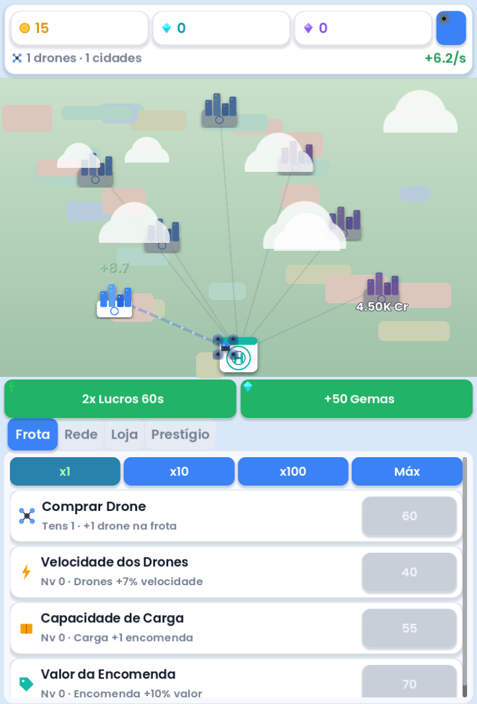

# Drone Tycoon: Sky Fleet 🚁

A modern **idle delivery tycoon** for Android, built with **Godot 4.6** (GDScript).
Run a fleet of delivery drones that fly packages between city hubs, earn **Créditos**,
upgrade your fleet, expand the network and **prestige** to grow exponentially.

**Portrait, full-screen. Flat modern UI. Real anti-aliased assets (no AI art).**



## Gameplay
1. **Drones** auto-fly routes from your base to delivery cities, dropping packages for Créditos.
2. **Upgrade** the fleet — buy more drones, increase speed, cargo per trip and package value.
3. **Expand the network** — unlock new cities (+18% network profit each and a new route).
4. **Boosts** — optional rewarded ads for 2× profits or free gems.
5. **Prestige** ("Expandir a Rede") — reset for permanent **Influência** (+10% global profit each).
6. **Idle / offline** — drones keep earning while you're away (up to 2h).

Currencies: **Créditos** (soft), **Gemas** (premium), **Influência** (prestige).

## Tech
- Godot 4.6.2, GL Compatibility, **portrait + `stretch=expand`** (fills any screen, no bars).
- Flat UI theme (rounded cards, soft shadows) + **Poppins** font.
- Assets generated by `tools/gen_art.py` (Pillow, supersampled/anti-aliased flat art).
- Autoloads: `Fmt`, `Economy`, `Billing`, `Ads`, `GameState`, `Audio`, `SaveSystem`.
- JSON save in `user://`, autosave + offline earnings; procedural audio SFX.

```
scripts/  economy.gd game_state.gd save_system.gd ads.gd billing.gd audio.gd format.gd ui_theme.gd main.gd map_view.gd
scenes/   main.tscn
tests/    sim.tscn (headless economy sim)  screenshot.tscn (visual smoke test)
assets/   art/ (flat PNGs)  fonts/ (Poppins)
tools/    gen_art.py  make_keystore.sh  build_apk.sh
```

## Monetization status
Fully playable with **placeholder** providers: `Ads` shows a simulated rewarded ad and grants the
reward; `Billing` grants purchases locally (no payment). The APIs match real AdMob / Google Play
Billing — see [docs/ADMOB_INTEGRATION.md](docs/ADMOB_INTEGRATION.md) to enable real revenue
(needs your AdMob account + Play Console products).

## Build
```bash
bash tools/make_keystore.sh      # one-time
bash tools/build_apk.sh          # -> export/DroneTycoon.apk
```
Needs Godot 4.6.2 + Android SDK + JDK 17+ and the matching export templates. Prebuilt APK is in
GitHub **Releases**. Android 7.0+ (arm64 / arm32).

## License
MIT — see [LICENSE](LICENSE).
